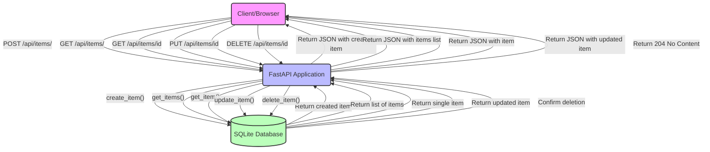

# FastAPI CRUD Application - Assignment

A collaborative assignment to implement CRUD (Create, Read, Update, Delete) operations in a FastAPI application.

## 📋 Project Overview

This project is a simple task management application built with FastAPI and SQLite. The application allows users to:
- Create new tasks
- View all tasks or a specific task
- Update existing tasks
- Delete tasks

Below is a diagram showing the CRUD operations flow:



The project structure is set up to facilitate collaborative development, where four developers will each implement one of the CRUD operations.

## 🚀 Getting Started

### Prerequisites

- Python 3.10+ installed
- Git

### Setup

1. **Clone the repository**

```bash
git clone https://github.com/EigenvectorsAndChill/fastapi_crud.git
cd fastapi-crud
```

2. **Create a virtual environment**

```bash
python -m venv .venv
source .venv/bin/activate  # On Windows, use: .venv\Scripts\activate
```

3. **Install dependencies**

```bash
pip install -r requirements.txt
```

4. **Run the application (skip this for now)**

```bash
uvicorn app.main:app --reload
```

5. **Access the application (skip this for now)**

- Web interface: http://127.0.0.1:8000/
- API documentation: http://127.0.0.1:8000/docs

## 📝 Assignment Instructions

This is a collaborative assignment where each team member is responsible for implementing one of the CRUD operations.

### Developer Workflow

1. **Fork the repository** to your GitHub account
   - Click the "Fork" button at the top right of the repository page
   - This creates a copy of the repository under your account

2. **Clone your fork** to your local machine
   ```bash
   git clone https://github.com/YOUR_USERNAME/fastapi_crud.git
   cd fastapi-crud
   ```

3. **Implement your assigned operation** in the corresponding file:
   - Create: `app/crud/create.py`
   - Read: `app/crud/read.py`
   - Update: `app/crud/update.py`
   - Delete: `app/crud/delete.py`

4. **Run the tests** for your implementation:
   ```bash
   python -m tests.test_create  # For the Create operation
   python -m tests.test_read    # For the Read operation
   python -m tests.test_update  # For the Update operation
   python -m tests.test_delete  # For the Delete operation
   ```

5. **Verify ALL tests pass** before proceeding with your pull request

6. **Submit a pull request** with your implementation
   - Commit your changes: `git add . && git commit -m "Implement X operation"`
   - Push to your fork: `git push origin main`
   - Go to the original repository and click "New Pull Request"
   - Select "Compare across forks" and select your fork
   - Create the pull request with a descriptive title and details about your implementation

### Implementation Guidelines

- **Read the TODOs and docstrings** in your assigned file carefully
- Follow the implementation steps described in the comments
- Do not modify files outside your assigned operation
- Make sure your code passes all the tests
- Use SQLAlchemy ORM for database operations
- Follow PEP 8 style guidelines

### Implementation Details

#### Create Operation (`app/crud/create.py`)

Your task is to implement the `create_item` function that:
1. Takes a database session and an item schema
2. Creates a new `Item` object using the data from the schema
3. Adds it to the database
4. Commits the transaction
5. Refreshes the item to get the auto-generated ID
6. Returns the created item

#### Read Operation (`app/crud/read.py`)

Your task is to implement two functions:
1. `get_item`: Retrieves a single item by ID
   - Returns `None` if the item doesn't exist
2. `get_items`: Retrieves multiple items with pagination
   - Applies offset (skip) and limit parameters

#### Update Operation (`app/crud/update.py`)

Your task is to implement the `update_item` function that:
1. Takes a database session, an item ID, and new item data
2. Retrieves the existing item by ID
3. Updates the item's attributes with the new values
4. Commits the changes to the database
5. Returns the updated item (or `None` if not found)

#### Delete Operation (`app/crud/delete.py`)

Your task is to implement the `delete_item` function that:
1. Takes a database session and an item ID
2. Retrieves the item by ID
3. Deletes the item from the database if it exists
4. Commits the changes
5. Returns `True` if the item was found and deleted, `False` otherwise

## 🧪 Testing

Unit tests are provided for each CRUD operation. You **MUST** run the tests for your implementation and ensure they all pass before submitting your pull request.

```bash
# Test Create operation
python -m tests.test_create

# Test Read operation
python -m tests.test_read

# Test Update operation
python -m tests.test_update

# Test Delete operation
python -m tests.test_delete

# Test Integration (run this after implementing all operations)
python -m tests.test_integration
```

## 📁 Project Structure Explained

```
fastapi_crud/
├── app/                      # Main application package
│   ├── crud/                 # CRUD operations - YOU WILL WORK HERE
│   │   ├── __init__.py       # Makes crud a proper package and exports operations
│   │   ├── create.py         # Create operation implementation
│   │   ├── read.py           # Read operation implementation
│   │   ├── update.py         # Update operation implementation
│   │   └── delete.py         # Delete operation implementation
│   ├── models/               # SQLAlchemy ORM models
│   │   ├── __init__.py
│   │   └── item.py           # Item database model definition
│   ├── routes/               # API route definitions
│   │   ├── __init__.py
│   │   └── item.py           # Item API endpoints
│   ├── schemas/              # Pydantic models for request/response
│   │   ├── __init__.py
│   │   └── item.py           # Item schema definitions
│   ├── static/               # Static files (CSS, JS)
│   │   ├── css/
│   │   │   └── styles.css
│   │   └── js/
│   │       └── script.js
│   ├── templates/            # HTML templates
│   │   └── index.html        # Main page template
│   ├── database.py           # Database connection setup
│   └── main.py               # Application entry point
├── tests/                    # Test package
│   ├── test_create.py        # Tests for create operation
│   ├── test_read.py          # Tests for read operations
│   ├── test_update.py        # Tests for update operation
│   ├── test_delete.py        # Tests for delete operation
│   └── test_integration.py   # Integration tests
├── .gitignore                # Git ignore file
├── requirements.txt          # Python dependencies
└── README.md                 # This file
```

### Key Files Explained

- **app/models/item.py**: Defines the `Item` SQLAlchemy model that maps to the database table
- **app/schemas/item.py**: Defines the Pydantic models used for request/response validation
- **app/routes/item.py**: Defines the API endpoints and connects them to the CRUD operations
- **app/database.py**: Sets up the SQLAlchemy engine, session, and base class
- **app/main.py**: Main application entry point that sets up FastAPI and includes routes

## 🔍 API Reference

### Item Schema

```json
{
  "id": 1,
  "title": "Example Item",
  "description": "This is an example item",
  "completed": false
}
```

### Endpoints

- **Create Item**
  - `POST /api/items/`
  - Request Body: `{ "title": "string", "description": "string", "completed": boolean }`

- **Read Items**
  - `GET /api/items/`
  - Query Parameters: `skip` (offset), `limit` (max items)

- **Read Item**
  - `GET /api/items/{item_id}`
  - Path Parameters: `item_id` (integer)

- **Update Item**
  - `PUT /api/items/{item_id}`
  - Path Parameters: `item_id` (integer)
  - Request Body: `{ "title": "string", "description": "string", "completed": boolean }`

- **Delete Item**
  - `DELETE /api/items/{item_id}`
  - Path Parameters: `item_id` (integer)
