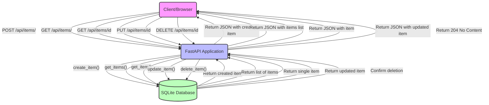

# FastAPI CRUD Application

A simple but complete CRUD (Create, Read, Update, Delete) application built with FastAPI and SQLite.

[Crud-App](https://github.com/user-attachments/assets/64c6521b-9e48-410f-a96b-46bf37bdd279)

This project demonstrates how to build a task management application using FastAPI and SQLite. The application allows users to:
- Create new tasks
- View all tasks or a specific task
- Update existing tasks
- Delete tasks

Below is a diagram showing the CRUD operations flow:



## 🚀 Getting Started

### Prerequisites

- Python 3.10+ installed
- Git

### Setup

1. **Clone the repository**

```bash
git clone https://github.com/EigenvectorsAndChill/fastapi_crud.git
cd fastapi_crud
```

2. **Create a virtual environment**

```bash
python -m venv .venv
source .venv/bin/activate  # On Windows, use: .venv\Scripts\activate
```

3. **Install dependencies**

```bash
pip install -r requirements.txt
```

4. **Run the application**

```bash
uvicorn app.main:app --reload
```

5. **Access the application**

- Web interface: http://127.0.0.1:8000/
- API documentation: http://127.0.0.1:8000/docs

## 🧪 Testing

The project includes comprehensive tests for all CRUD operations. To run the tests:

```bash
# Test individual operations
python -m tests.test_create
python -m tests.test_read
python -m tests.test_update
python -m tests.test_delete

# Test all operations together
python -m tests.test_integration
```

## 📁 Project Structure

```
fastapi_crud/
├── app/                      # Main application package
│   ├── crud/                 # CRUD operations
│   │   ├── __init__.py       # Makes crud a proper package and exports operations
│   │   ├── create.py         # Create operation implementation
│   │   ├── read.py           # Read operation implementation
│   │   ├── update.py         # Update operation implementation
│   │   └── delete.py         # Delete operation implementation
│   ├── models/               # SQLAlchemy ORM models
│   │   ├── __init__.py
│   │   └── item.py           # Item database model definition
│   ├── routes/               # API route definitions
│   │   ├── __init__.py
│   │   └── item.py           # Item API endpoints
│   ├── schemas/              # Pydantic models for request/response
│   │   ├── __init__.py
│   │   └── item.py           # Item schema definitions
│   ├── static/               # Static files (CSS, JS)
│   │   ├── css/
│   │   │   └── styles.css
│   │   └── js/
│   │       └── script.js
│   ├── templates/            # HTML templates
│   │   └── index.html        # Main page template
│   ├── database.py           # Database connection setup
│   └── main.py               # Application entry point
├── solutions/                # Reference implementations
│   └── crud/                 # Complete CRUD implementations
│       ├── __init__.py
│       ├── create.py         # Create operation solution
│       ├── read.py           # Read operation solution
│       ├── update.py         # Update operation solution
│       └── delete.py         # Delete operation solution
├── tests/                    # Test package
│   ├── test_create.py        # Tests for create operation
│   ├── test_read.py          # Tests for read operations
│   ├── test_update.py        # Tests for update operation
│   ├── test_delete.py        # Tests for delete operation
│   └── test_integration.py   # Integration tests
├── .gitignore                # Git ignore file
├── requirements.txt          # Python dependencies
├── test_solutions.sh         # Script to test solution implementations
└── README.md                 # This file
```

## 🔧 Implementation Details

### Key Components

- **CRUD Operations**: Located in the `app/crud/` directory, these functions handle database operations using SQLAlchemy ORM
- **Solution Directory**: The `solutions/` directory contains complete reference implementations of each CRUD operation
- **Test Script**: The `test_solutions.sh` script allows you to run tests using the solution implementations

### You can temporarily modify the `app/main.py` file to use the solution implementations instead of the app implementations.

## 🔍 API Reference

### Item Schema

```json
{
  "id": 1,
  "title": "Example Item",
  "description": "This is an example item",
  "completed": false
}
```

### Endpoints

- **Create Item**
  - `POST /api/items/`
  - Request Body: `{ "title": "string", "description": "string", "completed": boolean }`

- **Read Items**
  - `GET /api/items/`
  - Query Parameters: `skip` (offset), `limit` (max items)

- **Read Item**
  - `GET /api/items/{item_id}`
  - Path Parameters: `item_id` (integer)

- **Update Item**
  - `PUT /api/items/{item_id}`
  - Path Parameters: `item_id` (integer)
  - Request Body: `{ "title": "string", "description": "string", "completed": boolean }`

- **Delete Item**
  - `DELETE /api/items/{item_id}`
  - Path Parameters: `item_id` (integer)

## 📚 Key Files Explained

- **app/models/item.py**: Defines the `Item` SQLAlchemy model that maps to the database table
- **app/schemas/item.py**: Defines the Pydantic models used for request/response validation
- **app/routes/item.py**: Defines the API endpoints and connects them to the CRUD operations
- **app/database.py**: Sets up the SQLAlchemy engine, session, and base class
- **app/main.py**: Main application entry point that sets up FastAPI and includes routes
- 
## 🙏 Acknowledgments

This project was originally developed as a collaborative assignment. Thanks to all contributors who helped implement the CRUD operations.
